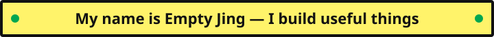
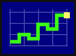
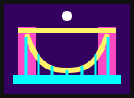

<!-- Welcome -->

  
   
   
  
   
   

<!-- Projects -->
<table width="100%" align="center">
  <tr>
    <td width="50%" align="center">
      <a href="https://github.com/Empty-Jing/gupiaoyuce">
        <strong>Visit gupiaoyuce</strong>
         
         
        
      </a>
      
Stock forecasting experiments built around data analysis and practical prediction workflows.

      <code>Python</code> · <code>Data analysis</code> · <code>Forecasting</code>
       
       
    </td>
    <td width="50%" align="center">
      <a href="https://github.com/Empty-Jing/claude-mem-opencode-bridge">
        <strong>Visit claude-mem-opencode-bridge</strong>
         
         
        
      </a>
      
A local bridge connecting claude-mem with OpenCode-managed authentication for memory compression.

      <code>Shell</code> · <code>OAuth</code> · <code>Local first</code>
       
       
    </td>
  </tr>
</table>

<!-- Toolbox -->

  <h3>Things I use</h3>
  
<code>Python</code> · <code>Java</code> · <code>C</code> · <code>Bash</code> · <code>Linux</code> · <code>Git</code>

<!-- Footer -->

   
  

